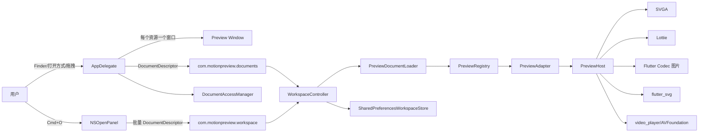

# Motion Preview 项目知识图谱

> 基于 2026-07-18 当前工作区代码梳理。本文描述实现现状。

## 1. 产品与边界

Motion Preview 是 macOS 优先的 Flutter 轻量多媒体预览器，每个资源使用独立窗口打开，窗口按图片/视频尺寸在屏幕范围内初始化。首期格式为 SVGA、Lottie JSON、GIF/WebP/APNG、PNG/JPG/JPEG/BMP/HEIC、SVG、MP4/MOV/M4V；WebM 只尝试系统视频后端。其他 Flutter 平台保持可编译并使用降级入口。

## 2. 系统图谱



## 3. 核心节点

| 节点 | 文件 | 职责 |
|---|---|---|
| `MyApp` | `lib/main.dart` | 初始化窗口管理器、macOS 主题和 `WorkspacePage`；窗口默认 1120x720，最小 760x520 |
| `WorkspacePage` | `lib/preview/workspace_page.dart` | macOS 标题栏工具栏、单资源画布、右侧检查器、快捷键和菜单 |
| `WorkspaceController` | `lib/preview/workspace_controller.dart` | 单窗口资源状态、错误状态、会话和背景偏好 |
| `PreviewDocumentLoader` | `lib/preview/preview_document_loader.dart` | 文件可访问性校验、格式解析、初始文件元信息和错误转换 |
| `PreviewRegistry` | `lib/preview/preview_registry.dart` | 扩展名映射和 Lottie 必要结构验证 |
| `PreviewAdapter` / `PreviewDocument` | `lib/preview/preview_models.dart` | 格式能力模型、资源描述、元信息和加载状态 |
| `PreviewHost` | `lib/preview/preview_host.dart` | 按能力创建/释放预览控制器并渲染当前文档 |
| `DocumentPlatformService` | `lib/preview/document_platform_service.dart` | Dart 侧平台通道、打开面板、待处理队列和资源释放 |
| `AppDelegate` | `macos/Runner/AppDelegate.swift` | 主工作台文件事件、Cmd+N 新窗口、窗口/引擎生命周期 |
| `MyFlutterViewController` | `macos/Runner/MyFlutterViewController.swift` | 注册批量文档通道、AVFoundation 元信息和访问权限管理 |
| `DocumentAccessManager` | `macos/Runner/MyFlutterViewController.swift` | 安全作用域书签的创建、恢复、释放和缺失文件定位 |
| `DragContainer` | `macos/Runner/DragContainer.swift` | 文件/目录拖拽并过滤支持的扩展名 |

## 4. 跨语言契约

```text
DocumentDescriptor {
  id: String,
  path: String,
  displayName: String,
  extension: String,
  source: finder | drag | openPanel | restore
}
```

| 通道 | 方法/事件 | 用途 |
|---|---|---|
| `com.motionpreview.documents` | EventChannel `documents` | 原生批量推送 Finder、拖拽和启动期间排队的资源 |
| `com.motionpreview.workspace` | `takePendingDocuments` | Flutter 启动时领取批量待处理资源 |
|  | `showOpenPanel` | 多选资源并为每个资源创建独立窗口 |
|  | `createWorkspaceWindow` | Cmd+N 创建空工作台 |
|  | `resolveBookmarks` | 会话恢复安全作用域书签 |
|  | `releaseDocuments` | 关闭窗口时释放访问权限和重型资源 |
|  | `locateMissingDocument` | 为恢复失败资源重新定位 |

原生只传递路径和描述符，不再传输 Base64 文件内容。每个资源窗口使用独立 FlutterEngine；关闭窗口时从引擎、额外窗口和书签访问集合中清理。图片和视频窗口会读取资源尺寸，并在屏幕范围内等比限制初始大小。

## 5. 预览与交互

`PreviewCapabilities` 驱动播放/缩放栏显隐：时间轴、逐帧、速度、循环、缩放和背景能力由格式适配器声明。`WorkspaceController` 只管理工作区状态，`PreviewDocumentLoader` 负责文件检查和格式加载，`PreviewRegistry` 负责扩展名与内容探测。SVGA、Lottie、动画图片和视频使用各自控制器；图片帧缓存上限 128MB。每个窗口只承载一个当前资源，窗口关闭时立即释放播放器、解码缓存和文件访问权限。

快捷键包括 Cmd+O/N/W、Cmd+Shift+W、Space、左右方向键、Cmd+0/1/+/-。画布支持棋盘格、浅色、深色和自定义背景，拖拽时显示整窗投放高亮。

## 6. 测试与索引

`test/preview_registry_test.dart` 覆盖扩展名映射和 Lottie 识别；`test/preview_document_loader_test.dart` 覆盖文件加载、初始元信息和缺失资源；`test/workspace_controller_test.dart` 覆盖去重、选择和关闭释放；`test/widget_test.dart` 覆盖空工作台。代码变更后运行：

```bash
codegraph sync .
flutter analyze
flutter test
flutter build macos --debug
```

## 7. 下一步优化方向

- 将 `PreviewHost` 按格式拆分为独立 adapter/widget 文件，降低单文件复杂度。
- 为 `DocumentPlatformService` 增加通道协议 fake，覆盖 Finder、拖拽、恢复和窗口关闭的跨语言契约。
- 为窗口尺寸计算和 Title Bar/Inspector 状态增加 macOS Widget/集成测试，覆盖初始化瞬间的窄约束。
- 将持久化数据增加版本迁移层，避免后续偏好字段变化破坏旧工作区。
