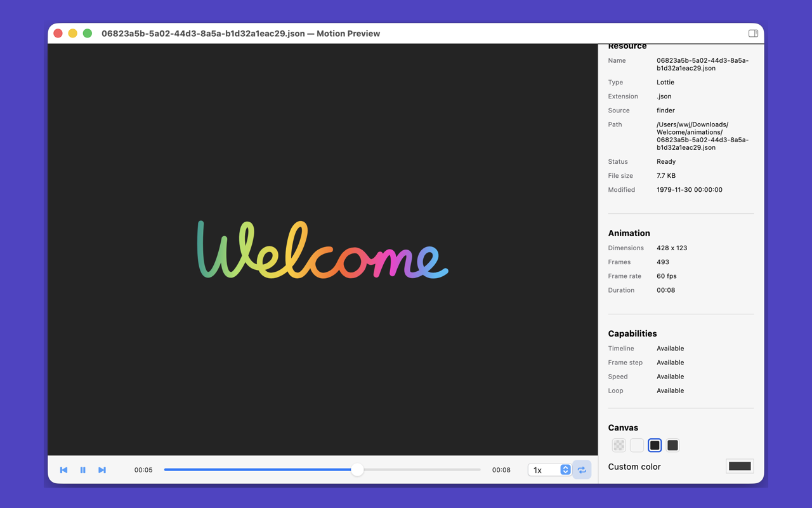

# Motion Preview

[简体中文](#简体中文) | [English](#english)

## 简体中文

### 专注于资源本身的 macOS 预览工具

Motion Preview 可以在独立窗口中快速打开动画、图片、矢量和视频资源。无需导入项目，也无需上传文件，即可查看画面、播放动态内容并检查格式信息。

### 一个文件，一个专注窗口

每个资源使用独立的 macOS 窗口打开。窗口会在屏幕可用范围内尽量匹配资源尺寸，让静态图片、动画和视频保持自然的查看比例。主窗口保留最近打开记录，便于快速返回之前的资源。

### 为动效资源准备的播放能力

根据文件格式，Motion Preview 可提供时间轴、播放与暂停、逐帧查看、播放速度和循环控制。画布支持棋盘格、浅色、深色及自定义背景，便于检查透明区域和不同背景下的视觉效果。

### 针对不同格式的 Inspector

从资源窗口标题栏展开 Inspector，即可查看文件路径、大小、修改时间、画面尺寸，以及帧数、帧率、时长、编码器或 SVG ViewBox 等格式专属信息。

### 支持格式

- SVGA 与 Lottie JSON
- PNG、JPG、JPEG、BMP 与 HEIC
- GIF、WebP 与 APNG 动态图片
- SVG 矢量图片
- MP4、MOV 与 M4V 视频
- WebM（播放能力取决于 macOS 系统解码器）

### 文件留在你的 Mac 上

资源仅在本机读取和解码，不会上传到网络。Motion Preview 适合设计师、动效工程师和客户端开发者快速检查交付资源。

## English

### A focused macOS viewer for motion and media assets

Motion Preview opens animations, images, vector artwork, and video in dedicated windows. Inspect visuals, play motion content, and review format details without importing a project or uploading a file.

### One file, one focused window

Every resource opens in its own native macOS window. Within the available screen area, the window follows the dimensions of the content for a natural viewing scale. The main window keeps a Recent list so previously viewed resources remain easy to reach.

### Playback controls for motion assets

When supported by the format, Motion Preview provides a timeline, play and pause, frame stepping, playback speed, and looping. Checkerboard, light, dark, and custom canvas backgrounds help reveal transparency and test artwork against different surfaces.

### Format-aware Inspector

Open the Inspector from the resource window title bar to review the path, file size, modification date, dimensions, and format-specific details such as frame count, frame rate, duration, codec, or SVG ViewBox.

### Supported Formats

- SVGA and Lottie JSON
- PNG, JPG, JPEG, BMP, and HEIC
- Animated GIF, WebP, and APNG
- SVG vector images
- MP4, MOV, and M4V video
- WebM when supported by the macOS system decoder

### Your files stay on your Mac

Resources are read and decoded locally and are not uploaded. Motion Preview gives designers, motion engineers, and client developers a direct way to inspect delivered assets.

